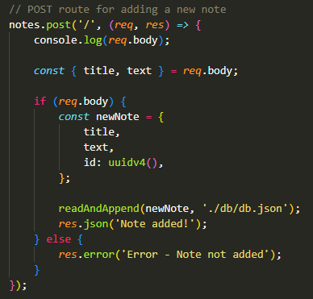

# Note-taker


## Description

This project allows users, such as small business owners, to add, view and delete notes to keep track of thoughts and tasks throughout the day.

Starter-code was provided for this application, which included all the front-end assets and code. This project required the creation of the back-end code using `Express.js` i.e. GET, POST and DELETE routes.

When the user first opens the web application, they are presented with a landing page with a link to a notes page. Then, once they click the link, they are taken to a `/notes` page.

The `/notes` page has previously entered notes in the left-hand column, which can be clicked on to retrieve the details in the right-hand column. This page also has fields in the right-hand column where the user can add in a note title and note text, which they can then save (which is put into a database and displayed in the left-hand column). Finally, once the user has completed the task or no longer needs a note, they can delete the note by clicking on the red bin icon, which removes the note from the list as well as from the database.

> This web application is deployed on Heroku and can be found here: https://adl-uni-express-js-note-taker.herokuapp.com/

## Table of contents

- [User story](#user-story)
- [Acceptance criteria](#acceptance-criteria)
- [Technologies used/built with](#technologies-usedbuilt-with)
- [Installation](#installation)
- [Usage](#usage)
- [Credits](#credits)
- [License](#license)

## User story

```
AS A small business owner
I WANT to be able to write and save notes
SO THAT I can organize my thoughts and keep track of tasks I need to complete
```

## Acceptance criteria

```
GIVEN a note-taking application
WHEN I open the Note Taker
THEN I am presented with a landing page with a link to a notes page
WHEN I click on the link to the notes page
THEN I am presented with a page with existing notes listed in the left-hand column, plus empty fields to enter a new note title and the note’s text in the right-hand column
WHEN I enter a new note title and the note’s text
THEN a Save icon appears in the navigation at the top of the page
WHEN I click on the Save icon
THEN the new note I have entered is saved and appears in the left-hand column with the other existing notes
WHEN I click on an existing note in the list in the left-hand column
THEN that note appears in the right-hand column
WHEN I click on the Write icon in the navigation at the top of the page
THEN I am presented with empty fields to enter a new note title and the note’s text in the right-hand column
```

## Technologies used/built with

This project used the following technologies to build it (technologies within starter code not included below):

- Node.js
- Express.js / Express NPM package
- JavaScript
- uuid NPM package
- `fs` for file creation

## Installation

1. Clone the repo (HTTPS: `git clone https://github.com/CharDige/Note-taker.git` or SSH: `git clone git@github.com:CharDige/Note-taker.git`)

2. Install Express.js / Express NPM package (`npm install express`)

3. Install uuid NPM package (`npm install uuid`)

## Usage

Below, you will find screenshots of the deployed application, what you see in the console when the application is running on a local server, and some of the corresponding code.

### Deployed application on Heroku

> This web application is deployed on Heroku and can be found here: https://adl-uni-express-js-note-taker.herokuapp.com/

When a user launches the web application, they are provided with a landing page with a link to 'Get started' i.e. start taking notes.


Once the user has clicked through, they are presented with a page with existing notes in the left-hand column and empty fields to enter a new note title and note text in the right-hand column.


When a new note is created, a save button appears in the navigation. Once clicked on, The new note will be displayed in the left-hand column.


The user can also click on the existing notes in the left-hand column, which will provide the details of the note in the right-hand column.


And, finally, the user can click on the red bin icon, which will delete the note from the list.


### The command-line and initiating the local server

All of the above can be tracked via the command-line, with a `cLog.js` file created that pushes logs to the command-line when a GET, POST or DELETE route is requested.

First, the application can be launched via a localhost (for this, we're using PORT 3001). This can be done using `node server.js` in the command-line or, as seen below, `nodemon server.js` (if you have nodemon installed).


When you open the local server, a number of GET requests are logged into the command-line, which detail what's being requested.


When a note is saved, a POST request is logged, including a log of the `req.body` and a notification that the database has been updated.


And, when a note is deleted, DELETE requests are logged, with a notification that the database has been updated.


### Code snippets

Below are screenshots of some sections of code, including the comments in the code. I've also provided which file they're in.

**server.js in root directory**


**note.js in routes directory**




**clog.js in middleware directory**


## Credits

Here's a list of resources I'd like to credit that really helped with the development of this application:

- [npm - uuid](https://www.npmjs.com/package/uuid)
- [Stack Overflow - How to change node.js's console font color?](https://stackoverflow.com/questions/9781218/how-to-change-node-jss-console-font-color)
- [GeeksforGeeks - Express.js req.params Property](https://www.geeksforgeeks.org/express-js-req-params-property/)
- [Express - Routing](https://expressjs.com/en/guide/routing.html)
- [DigitalOcean - 'How To Retrieve URL and POST parameters with Express' by Chris Sev](https://www.digitalocean.com/community/tutorials/use-expressjs-to-get-url-and-post-parameters)
- [Heroku Dev Center - Deploying with Git](https://devcenter.heroku.com/articles/git)

## License

[MIT License - Copyright (C) 2022 Charlotte Dige](./LICENSE)